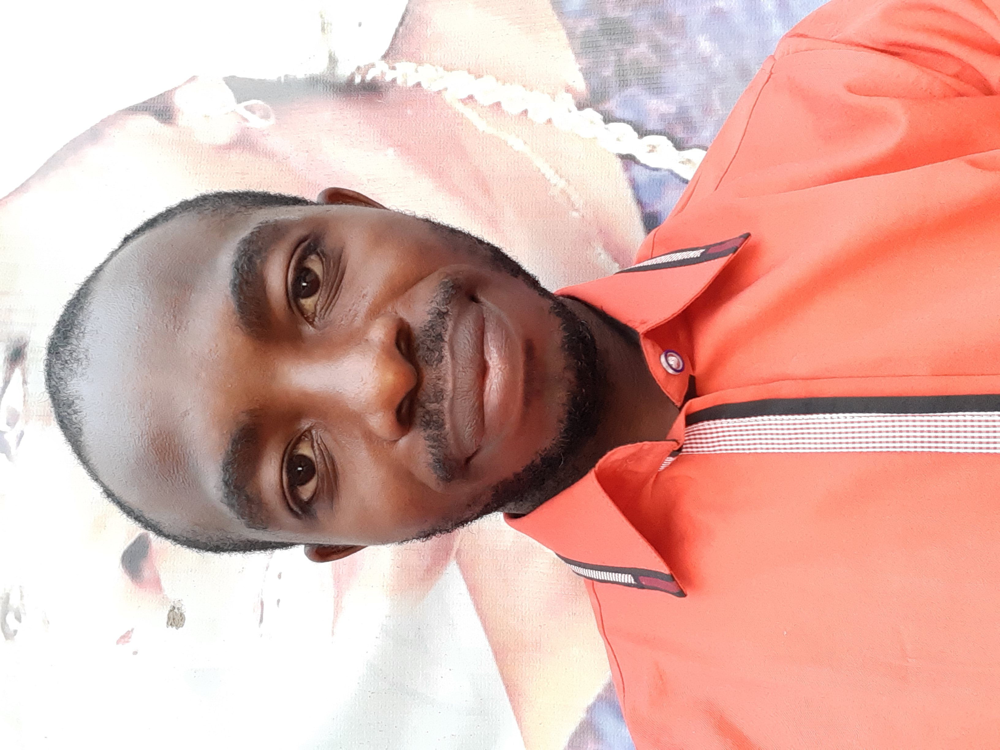

<!DOCTYPE html>

<html lang="eng">

<head>

<title>CV profile for Emmanuel Adewumi</title>

</head>

<body>
 

<h1> ADEWUMI EMMANUEL GBADEBO
  
  <h3>No 4, Bello Street, Ketu Ikosi, Lagos State State. 
    +2348106080569, +2348113845745, | emmanuealadewumig@mail.com 
	<a href="https://www.linkedin.com/in/emmanueladewumig">linkedin.com/in/emmanueladewumig</a> 
	 
	

	

<h3>CAREER OBJECTIVES

 
	<h4>To utilise my technical and management skills for achieving targets and developing the best performance in 
any company I find myself. I want to implement my innovative ideas, technology savviness skills and creativity  for solving
business challenges.
 

<h3>EDUCATIONAL DETAILS: 
<ol>
  <li>Federal University of Petroleum Resources, Effurun.</strong> (2011 -2017)</li>
  <li>Federal Science and Technical College, Ilesa, Osun State. (2002 - 2009)</li>
</ol>

 
<h3>WORK EXPERIENCE 
<ul>
	<li>GMI Construction Services, Warri. (Oct 2005 - June 2006)</li>
	<li>Ayomi Interbize International, Ilesa, Osun State. (July 2006 - May 2007)</li>
</ul>
<hr/ style="width:90%;text-align:center;margin-center:0"/>
<page-break-after>
<strong>SKILLS 
<ul>
<li>Python</li>
<li>Microsoft Excel (Advanced)</li>
<li>Customer Relationship MAnagement</li>
<li>Creative Writing</li>
</ul>

</body>

</html>

